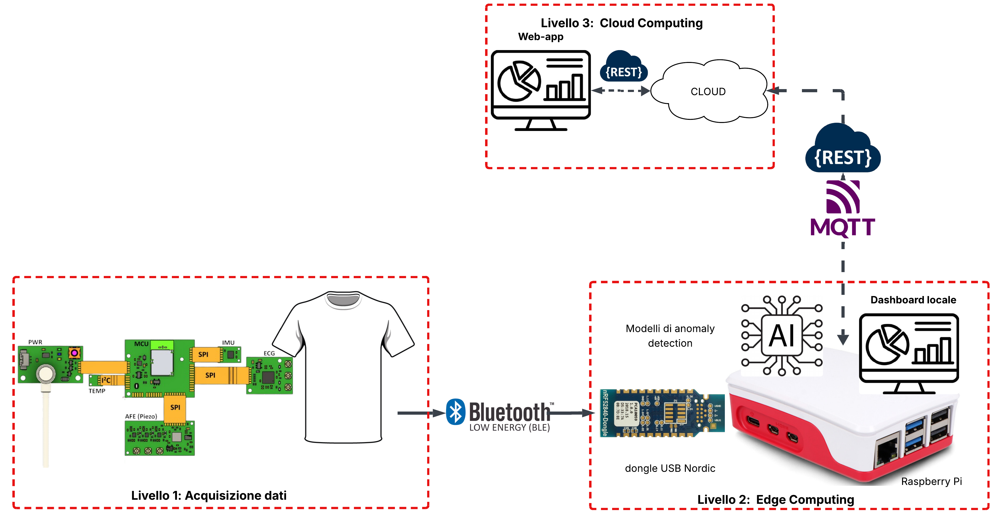
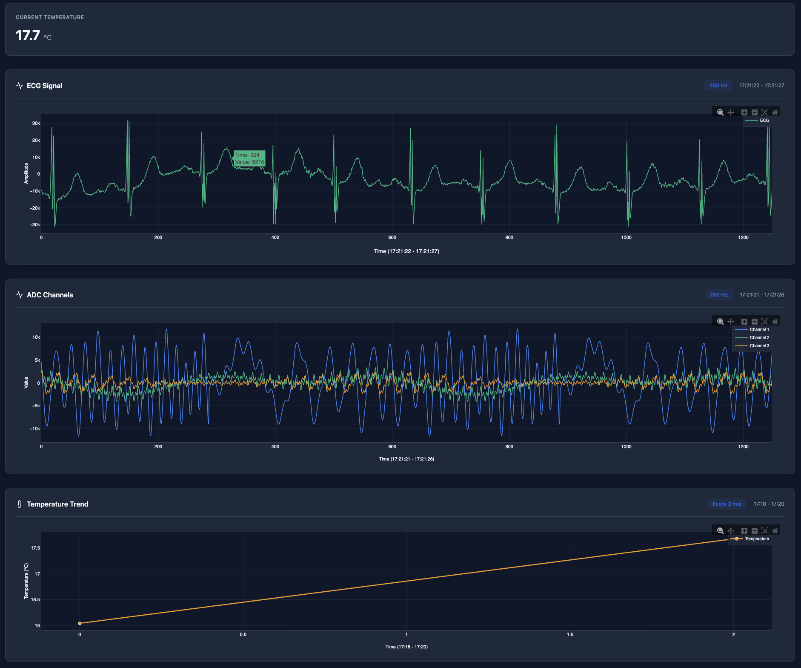
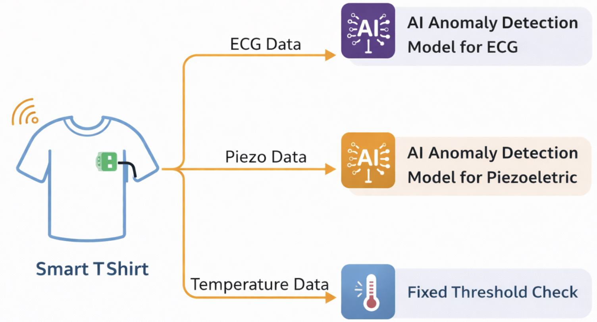
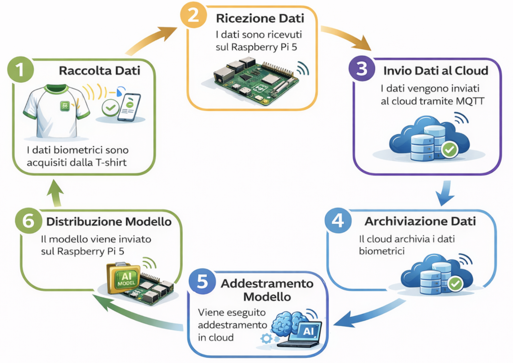
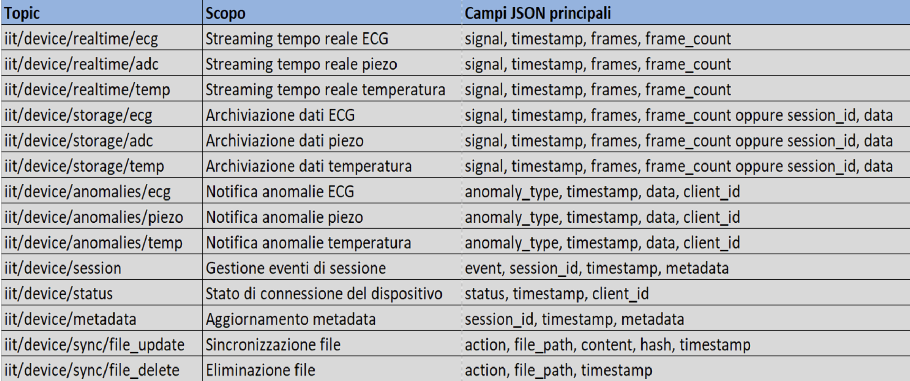
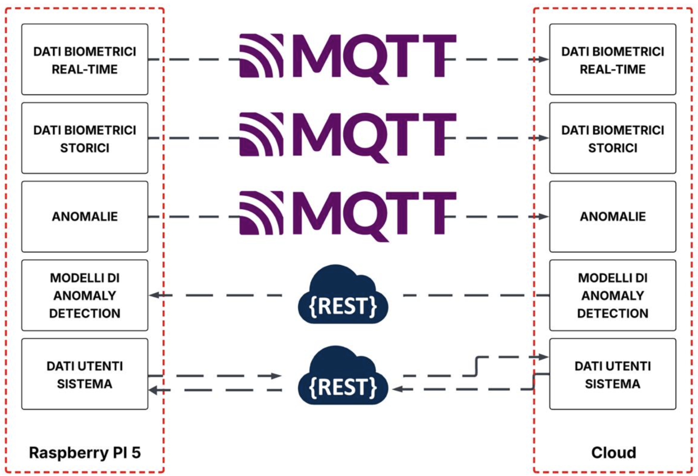
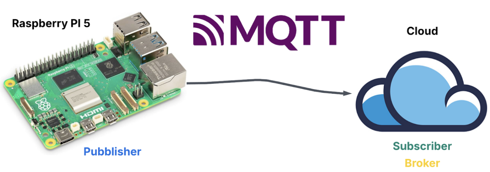

# T-Shirt Smart - Sistema di Monitoraggio Biometrico Edge-Cloud

Sistema di acquisizione e analisi in tempo reale dei parametri biometrici basato su architettura Edge-Cloud, sviluppato in collaborazione con l'**Istituto Italiano di Tecnologia (IIT) di Arnesano** e l'**IDA Lab dell'Università del Salento**.

---

## Indice

1. [Presentazione del Progetto](#1-presentazione-del-progetto)
2. [Architettura del Sistema](#2-architettura-del-sistema)
   - [2.1 Dispositivo Indossabile](#21-dispositivo-indossabile)
   - [2.2 Gateway Edge (Raspberry Pi 5)](#22-gateway-edge-raspberry-pi-5)
   - [2.3 Infrastruttura Cloud](#23-infrastruttura-cloud)
   - [2.4 Comunicazione Edge-Cloud](#24-comunicazione-edge-cloud)
3. [Link ai Componenti](#3-link-ai-componenti)
4. [Descrizione dei Componenti](#4-descrizione-dei-componenti)
   - [4.1 Componente Edge](#41-componente-edge)
   - [4.2 Componente Cloud](#42-componente-cloud)
5. [Autori](#5-autori)

---

## 1. Presentazione del Progetto

Il sistema **T-Shirt Smart** rappresenta una soluzione per il monitoraggio continuo e non invasivo dei parametri fisiologici attraverso una t-shirt dotata di sensori biomedici integrati. Il sistema sfrutta **modelli di Intelligenza Artificiale per l’esecuzione di tecniche di anomaly detection** sui segnali biometrici acquisiti, con l’obiettivo di **identificare tempestivamente comportamenti anomali o potenzialmente pericolosi** rispetto al profilo fisiologico dell’utente.

L’architettura del sistema è progettata secondo un paradigma **edge-cloud**, al fine di garantire l’acquisizione in tempo reale dei dati biometrici, una **bassa latenza nella rilevazione delle anomalie** e una gestione flessibile dei modelli di Intelligenza Artificiale. In particolare, l’elaborazione dei segnali in edge consente di generare **meccanismi di allerta verso il paziente e il personale medico** in caso di eventi critici, riducendo i tempi di reazione.

Tale approccio permette inoltre di limitare la dipendenza da una connettività continua verso il cloud, ottimizzando le prestazioni complessive del sistema e garantendo la **continuità operativa anche in presenza di connettività intermittente**, senza compromettere le funzionalità di monitoraggio e segnalazione.

### Segnali Biometrici Monitorati

Il sistema acquisisce i seguenti parametri fisiologici:

| Sensore | Descrizione |
|---------|-------------|
| **ECG** | Segnale elettrocardiografico |
| **Temperatura** | Temperatura corporea |
| **Piezoelettrico** | Segnali di movimento e postura |

*Figura 1.1: Architettura generale del sistema*

---

## 2. Architettura del Sistema

Il sistema T-Shirt Smart si articola su **due livelli architetturali distinti** 
che collaborano per garantire un flusso continuo ed efficiente dei dati biometrici:

- **Livello 1 - Acquisizione Dati**: dispositivo indossabile con sensori integrati 
  e trasmissione wireless via Bluetooth Low Energy
- **Livello 2 - Edge Computing**: gateway Raspberry Pi 5 per elaborazione locale, 
  inferenza ML e comunicazione verso il cloud
- **Livello 3 - Cloud Computing**: Server cloud che riceve i dati dal Raspberry Pi, li visualizza e permette l'addestramento di nuovi modelli

Ciascun livello è progettato per operare in modo autonomo, garantendo modularità, 
scalabilità e continuità operativa anche in scenari di connettività intermittente.

### 2.1 Dispositivo Indossabile

Il dispositivo indossabile è costituito da una t-shirt HiTech nella quale sono integrati sensori biomedici che consentono l'acquisizione continua e non invasiva dei parametri fisiologici dell'utente. I sensori integrati sono collegati a una piattaforma di acquisizione basata sul microcontrollore **Nordic nRF5340**, che svolge il ruolo di unità di controllo e gestione dei dati.

#### Architettura Hardware

Il microcontrollore nRF5340 è una piattaforma dual-core composta da:

- **Application Core**: responsabile della comunicazione con i sensori periferici, della gestione delle interfacce hardware e dell'elaborazione preliminare dei dati acquisiti.
- **Network Core**: dedicato esclusivamente alla gestione della comunicazione Bluetooth Low Energy (BLE), consentendo una separazione chiara tra logica applicativa e comunicazione wireless.

Questa architettura migliora l'affidabilità del sistema e consente di mantenere prestazioni stabili anche in presenza di flussi di dati continui.

#### Trasmissione Dati

I dati acquisiti dai sensori vengono organizzati dal microcontrollore in pacchetti binari strutturati, con dimensione massima pari a 240 byte, in conformità con le specifiche dello stack Bluetooth Low Energy. I pacchetti vengono trasmessi via BLE verso un dongle USB ricevente basato sul microcontrollore **nRF52840**, anch'esso prodotto da Nordic Semiconductors.

*Figura 2.1: Dongle USB BLE basato su microcontrollore nRF52840 utilizzato per la ricezione dei dati biometrici trasmessi dalla T-Shirt Smart.*

Il dongle riceve i pacchetti trasmessi, li decodifica secondo il protocollo di comunicazione definito e rende i dati disponibili al gateway edge. Dal punto di vista del sistema operativo del gateway, il dongle espone i flussi di dati biometrici tramite porta seriale virtuale.

#### Stati Operativi

Il dispositivo indossabile fornisce feedback visivo attraverso LED di stato integrati:

| Stato LED | Significato |
|-----------|-------------|
| **Spento** | Sistema non alimentato |
| **Blu lampeggiante** | Sistema acceso, pronto alla connessione BLE |
| **Blu fisso** | Fase di collegamento in corso |
| **Blu + Verde + Rosso** | Connessione stabilita, trasmissione attiva |

*Figura 2.2: Sistema operativo e trasmissione dati attiva - la presenza simultanea dei LED blu, verde e rosso indica che la connessione BLE è stata stabilita correttamente e che la scheda sta trasmettendo i dati biometrici acquisiti.*

### 2.2 Gateway Edge (Raspberry Pi 5)

Il gateway edge rappresenta un componente centrale nell'architettura del sistema T-Shirt Smart ed è implementato su piattaforma **Raspberry Pi 5**. Esso svolge il ruolo di nodo di edge computing, fungendo da punto di raccolta, elaborazione, visualizzazione e inoltro dei dati biometrici, provenienti dal dispositivo indossabile, verso il cloud.

La collocazione del gateway a livello edge consente di ridurre la latenza nella gestione dei segnali e di garantire la continuità operativa del sistema anche in presenza di connettività intermittente verso l'infrastruttura cloud.

#### Elaborazione dei Dati

Il Raspberry Pi riceve i pacchetti trasmessi dalla piattaforma Nordic tramite la connessione seriale virtuale instaurata dal dongle Bluetooth Low Energy collegato via USB. I pacchetti ricevuti vengono sottoposti a una fase di validazione, durante la quale i dati vengono decodificati, verificati e classificati in base alla tipologia di segnale (ECG, temperatura corporea, segnale piezoelettrico).

Questa fase è fondamentale per garantire l'integrità dei dati e per mantenere separati flussi caratterizzati da frequenze di campionamento e proprietà differenti.

#### Dashboard Locale

Una volta elaborati, i dati biometrici vengono resi disponibili a una dashboard locale eseguita direttamente sul gateway edge. La dashboard, sviluppata come applicazione web, consente la visualizzazione in tempo reale dei segnali acquisiti, organizzando i grafici in modo distinto per ciascun sensore. Un aspetto rilevante è che la visualizzazione locale rimane disponibile anche in assenza di connessione verso il server cloud, aumentando l'affidabilità complessiva del sistema. 

  

Figura 2.3: Dashboard locale eseguita sul gateway edge per la visualizzazione in tempo reale dei segnali ECG, dei canali ADC e dell’andamento della temperatura corporea.</em>

#### Anomaly Detection

Oltre alle funzionalità di acquisizione e visualizzazione, il gateway edge ospita i moduli di inferenza per la rilevazione automatica delle anomalie. I modelli di anomaly detection vengono addestrati lato cloud e successivamente convertiti in formato **TensorFlow Lite**, ottimizzato per l'esecuzione su dispositivi embedded. I modelli così ottenuti vengono caricati sul Raspberry Pi ed eseguiti direttamente sul gateway, consentendo l'analisi dei segnali biometrici in tempo quasi reale.

*Figura 2.4: Schema di elaborazione dei segnali biometrici acquisiti dalla smart T-shirt e delle relative strategie di rilevazione delle anomalie.*

Questa scelta architetturale permette di ridurre significativamente la latenza nella rilevazione delle anomalie e di mantenere attivo il sistema di monitoraggio anche in caso di temporanea disconnessione dal cloud.

Dal punto di vista funzionale, il Raspberry Pi implementa quindi un vero e proprio nodo di edge computing incaricato di ricevere i pacchetti binari dal dongle BLE, eseguire il parsing e la validazione dei dati, visualizzare i segnali biometrici tramite dashboard locale, eseguire l'inferenza dei modelli di anomaly detection e pubblicare i dati e gli eventi verso l'infrastruttura cloud.

### 2.3 Infrastruttura Cloud

La componente **cloud** è implementata, in fase di sviluppo e test, su un PC dedicato. In particolare, per le attività di sperimentazione è stato utilizzato un **MacBook Air M1**, configurato per ospitare i diversi servizi inclusi nella parte cloud del progetto Smart T-Shirt.

La decisione di adottare una piattaforma locale anziché un’infrastruttura cloud commerciale, come AWS o Microsoft Azure, è stata motivata da **esigenze di contenimento dei costi**, nonché dalla volontà di mantenere un maggiore controllo sull’ambiente di esecuzione durante le fasi di sviluppo e validazione del sistema. Tale scelta consente di riprodurre in modo fedele le funzionalità di un backend cloud reale, senza introdurre costi operativi aggiuntivi.

L’architettura del sistema rimane comunque **facilmente migrabile verso soluzioni cloud**, qualora richiesto da scenari applicativi futuri.

#### Modulo di Ricezione e Archiviazione

Il modulo di ricezione è responsabile dell'acquisizione dei dati biometrici pubblicati dal gateway edge tramite il protocollo MQTT. Tali dati vengono archiviati in modo persistente secondo una struttura organizzata per sessioni di acquisizione e tipologia di segnale biometrico. Questa organizzazione consente sia la tracciabilità storica delle misurazioni sia l'esecuzione di analisi sui dati raccolti nel tempo.

#### Web Application Cloud

La web application cloud offre le stesse funzionalità di monitoraggio e visualizzazione disponibili sulla dashboard locale presente sul gateway edge, garantendo una visione coerente e centralizzata dello stato del sistema. Inoltre, l'interfaccia cloud mette a disposizione una funzionalità avanzata: la possibilità di addestrare nuovi modelli di intelligenza artificiale per l'anomaly detection utilizzando i dati biometrici storicamente archiviati.

#### Training e Deploy dei Modelli

L'addestramento dei modelli viene eseguito esclusivamente nell'ambiente cloud, in quanto tale operazione risulta computazionalmente onerosa e non adatta all'esecuzione su dispositivi edge a risorse limitate. Al termine del processo di addestramento, il modello generato viene accompagnato da un insieme di metadati descrittivi, tra cui il nome del modello, la data di addestramento e le sessioni di dati utilizzate.

Queste informazioni, insieme al modello addestrato, vengono trasmesse al gateway edge tramite paradigma REST, in modo che possano essere utilizzate operativamente e visualizzate anche all'interno della dashboard locale, garantendo coerenza tra ambiente edge e ambiente cloud.

*Figura 2.5: Schema del flusso operativo end-to-end del sistema T-Shirt Smart, dalla raccolta dei dati biometrici all'addestramento e alla ridistribuzione dei modelli di anomaly detection.*

### 2.4 Comunicazione Edge-Cloud

La comunicazione tra il gateway edge e l'infrastruttura cloud avviene tramite una combinazione dei protocolli **MQTT** e **REST**, scelti per garantire affidabilità, scalabilità e flessibilità in un contesto IoT.

#### Protocollo MQTT

Il gateway edge utilizza il protocollo MQTT per la trasmissione dei dati biometrici verso il cloud. I dati vengono pubblicati su topic MQTT distinti, separando i flussi informativi in:

- Dati biometrici in tempo reale
- Dati biometrici storici destinati allo storage
- Segnalazioni di anomalie rilevate localmente

La seguente tabella riassume i principali topic MQTT utilizzati dal sistema:

  

  <em>Figura 2.6: Struttura dei topic MQTT utilizzati per lo streaming dei dati biometrici, l’archiviazione, la segnalazione delle anomalie e la gestione delle sessioni.</em>

*Figura 2.7: Schema dei flussi di comunicazione tra gateway edge (Raspberry Pi 5) e infrastruttura cloud basati su MQTT e REST.*

#### Protocollo REST

Il paradigma REST viene invece adottato per le comunicazioni di controllo tra cloud ed edge, come la gestione dei dati di configurazione, delle informazioni sugli utenti di sistema e lo scambio dei modelli di anomaly detection. Le API REST permettono un'interazione strutturata, standardizzata e facilmente integrabile con servizi esterni.

*Figura 2.8: Schema di comunicazione MQTT tra il gateway edge Raspberry Pi 5, che opera come publisher, e il server cloud, che svolge il ruolo di broker e subscriber.*

L'uso congiunto di MQTT e REST consente di separare in modo chiaro i canali di data streaming dai canali di controllo e gestione, ottimizzando le prestazioni complessive del sistema e rendendolo robusto in scenari di monitoraggio continuo. La separazione dei flussi informativi su topic distinti consente una gestione modulare e scalabile della comunicazione, riducendo il carico sui servizi cloud e facilitando l'estensione futura del sistema con nuovi segnali o nuovi moduli applicativi.

---

## 3. Link ai Componenti

Il progetto T-Shirt Smart è suddiviso in due repository GitHub principali, ciascuno contenente l'implementazione completa di uno dei componenti dell'architettura:

### Gateway Edge (Raspberry Pi 5)

**Repository**: [wot-project-2024-2025-edge-DeDominicis-Miccoli](https://github.com/UniSalento-IDALab-IoTCourse-2024-2025/wot-project-2024-2025-edge-DeDominicis-Miccoli)

Contiene l'implementazione del nodo di edge computing su Raspberry Pi 5, responsabile dell'acquisizione dati dal dispositivo indossabile, dell'elaborazione locale, della visualizzazione real-time e dell'inferenza dei modelli di anomaly detection.

### Infrastruttura Cloud

**Repository**: [wot-project-2024-2025-cloud-DeDominicis-Miccoli](https://github.com/UniSalento-IDALab-IoTCourse-2024-2025/wot-project-2024-2025-cloud-DeDominicis-Miccoli)

Contiene l'implementazione dell'infrastruttura cloud, responsabile della ricezione e archiviazione dei dati biometrici, della gestione utenti, del training dei modelli di machine learning e del deploy automatico dei modelli addestrati verso i gateway edge.

---

## 4. Descrizione dei Componenti

### 4.1 Componente Edge

Il componente Edge implementa tutte le funzionalità del gateway Raspberry Pi 5. È progettato per operare in modo autonomo e resiliente, garantendo la continuità del monitoraggio anche in assenza di connettività cloud. Di seguito è presentata una descrizione organizzata dei moduli che compongono il sistema, suddivisi per categoria funzionale.

#### Core Application

**IITdata_acq.py**

Script principale di acquisizione dati. Gestisce la comunicazione seriale con il dongle USB BLE, coordina i thread di lettura per shell e data port, e orchestra il flusso completo di acquisizione, storage e pubblicazione MQTT.

**dashboard_server.py**

Server Flask che implementa la dashboard web locale. Fornisce interfaccia real-time per visualizzazione segnali biometrici, controllo acquisizione, consultazione storico sessioni e gestione modelli ML.

#### Data Acquisition & Processing

**serial_threads.py**

Thread worker per comunicazione seriale. Implementa LineReader per shell port (comandi) e data port (stream dati), con gestione eventi e validazione connessione. Codice fornito da IIT

**handler_data.py**

Parser dei pacchetti binari ricevuti dal dispositivo BLE. Decodifica la struttura dei pacchetti (240 byte) ed estrae i campioni per ciascuna tipologia di segnale (ECG, temperatura, piezoelettrico). Codice fornito da IIT

**channel_manager.py**

Gestore delle code temporali dei dati. Mantiene buffer separati per ciascun sensore, gestisce le differenti frequenze di campionamento e fornisce i dati ai moduli di visualizzazione e anomaly detection.

#### Storage & Persistence

**data_storage.py**

Modulo di archiviazione persistente. Organizza i dati acquisiti in sessioni strutturate (cartelle per data e sessione), salva metadata JSON e gestisce file JSONL per i campioni.

**fix_metadata.py**

Script utility per ricalcolo metadata sessioni. Conta campioni effettivi nei file JSONL, ricalcola end_time corretto basandosi su frequenze di campionamento.

#### Anomaly Detection

**ecg_anomaly_detector.py**

Detector di anomalie per segnali ECG. Carica modelli TensorFlow Lite, esegue inferenza autoencoder in tempo reale, calcola reconstruction error e applica threshold per classificazione.

**piezo_anomaly_detector.py**

Detector di anomalie per segnali piezoelettrici. Opera in modo analogo al detector ECG, specializzato per pattern di movimento e postura.

**temp_anomaly_detector.py**

Detector di anomalie per segnali di temperatura corporea. Monitora trend temporali, rileva ipotermia/ipertermia attraverso threshold fissi e classifica severity (mild/moderate/severe) basandosi su durata e intensità dell'anomalia.

**model_management_api.py**

API REST per gestione modelli ML. Fornisce endpoint per listing, attivazione e configurazione modelli, con gestione file active_model.json per selezione runtime.

#### Cloud Communication

**mqtt_publisher.py**

Client MQTT per pubblicazione dati verso il cloud. Gestisce topic separati per real-time, storage e anomalie, implementa batching e reconnection automatica.

**mqtt_config.py**

File di configurazione MQTT centralizzato. Definisce broker address, topic structure, batch sizes, sync intervals e opzioni QoS/TLS.

**file_watcher_addon.py**

Modulo opzionale basato su watchdog. Monitora cartelle data_storage e anomaly_logs, triggera sync automatico dei file modificati verso MQTT cloud.

#### Authentication & User Management

**auth_db.py**

Database SQLite per autenticazione utenti. Implementa hashing password con bcrypt, gestione sessioni con token, e supporto per sincronizzazione con il cloud.

**db_sync_module.py**

Servizio di sincronizzazione database utenti tra edge e cloud. Confronta timestamp updated_at, risolve conflitti e mantiene coerenza bidirezionale via REST API.

#### Configuration & Utilities

**detect_usb_ports.py**

Utility cross-platform per rilevamento automatico porte seriali USB. Scansiona dispositivi disponibili e gestisce configurazione port shell/data persistente.

**usb_ports_config.json**

File di configurazione JSON per porte seriali USB. Specifica i device path per shell_port (comandi) e data_port (stream dati) del dongle BLE, aggiornato automaticamente da detect_usb_ports.py.

**file_log_watcher.py**

Monitor real-time del file system.log. Legge nuove righe, le categorizza (MQTT, Dashboard, Anomaly) e le streama alla dashboard via SocketIO per debug live.

#### Testing & Development

**simulate_anomaly.py**

Generatore di anomalie sintetiche per testing. Crea sample data realistici (forme d'onda ECG, pattern PIEZO) e popola file anomaly_logs per sviluppo/debug.

#### Frontend - HTML Templates

**dashboard.html**

Template HTML principale dell'interfaccia web locale. Struttura la dashboard con sezioni per visualizzazione real-time, storico sessioni, anomalie, gestione modelli, debug e settings, con supporto SocketIO per aggiornamenti live.

**login.html**

Pagina di autenticazione utenti. Interfaccia minimale per login con username/password, validazione client-side e redirect post-autenticazione verso dashboard principale.

**register.html**

Template HTML per la pagina di registrazione utenti. Fornisce interfaccia web per creazione nuovi account con campi nome, cognome, username, password e selezione ruolo (paziente/medico/admin).

#### Frontend - JavaScript Modules

**dashboard.js**

Controller JavaScript principale della dashboard web. Gestisce navigazione tra sezioni, inizializzazione SocketIO per stream real-time, rendering grafici Chart.js e coordinamento logiche frontend.

**anomalies.js**

Modulo JavaScript per visualizzazione anomalie rilevate. Implementa filtri per tipologia/data, rendering card anomalie con grafici sample data e funzionalità export JSON/CSV.

**history.js**

Gestione interfaccia dati storici. Carica elenco sessioni acquisite, visualizza metadata, permette consultazione grafici retrospettivi e download sessioni in formato JSON.

**models.js**

Interfaccia gestione modelli ML. Visualizza modelli disponibili per ECG/PIEZO, permette selezione modello attivo, configurazione threshold dinamici e mostra dettagli training (immagini loss/reconstruction).

**debug.js**

Console debug real-time via SocketIO. Riceve log dal server categorizzati per modulo (MQTT, Serial, Anomaly), applica filtri per livello (INFO/WARNING/ERROR), supporta export e clear.

**notifications.js**

Sistema notifiche push persistent. Riceve eventi anomalia via SocketIO, mostra toast notification con sample data, gestisce audio alerts opzionali e mantiene storico notifiche consultabile.

**settings.js**

Pannello configurazione porte seriali USB. Rileva automaticamente porte disponibili tramite API backend, permette assegnazione shell_port/data_port e salva configurazione persistente.

**user_management.js**

Interfaccia admin per gestione utenti. Lista utenti registrati, permette creazione/modifica/eliminazione account, gestione ruoli (paziente/medico/admin) e reset password.

#### Frontend - CSS Stylesheets

**dashboard.css**

Foglio di stile principale con variabili CSS per tema dark, layout responsive grid-based, animazioni transizioni e componenti riutilizzabili (card, button, badge).

**anomalies.css**

Stili specifici sezione anomalie. Card anomalie con colori distintivi per tipologia (ECG verde, PIEZO blu, TEMP arancio), layout grid responsivo e chart container ottimizzati.

**models.css**

Stili gestione modelli con radio button custom, layout two-column (lista modelli + pannello threshold), modal fullscreen per dettagli training e image gallery lightbox.

**debug.css**

Stili console debug terminal-style. Background scuro, syntax highlighting per livelli log, colori distintivi per categorie (MQTT viola, Serial verde, Error rosso).

**notifications.css**

Stili sistema notifiche con animazioni slide-in/out.

**user_management.css**

Stili tabella utenti admin-only. Layout table responsivo, action buttons inline, modal edit utente con form styling e status badges per ruoli utente.

### 4.2 Componente Cloud

Il componente Cloud implementa tutte le funzionalità del server centralizzato. È progettato per la ricezione dati MQTT dal Raspberry Pi, archiviazione persistente, training modelli ML computazionalmente onerosi e distribuzione automatica verso edge. Di seguito è presentata una descrizione organizzata dei moduli che compongono il sistema, suddivisi per categoria funzionale.

#### Core Application

**dashboard_server_cloud.py**

Server Flask principale per dashboard web cloud. Gestisce API REST per consultazione dati storici, visualizzazione anomalie, training modelli ML, gestione utenti e deploy automatico modelli verso Raspberry Pi via HTTP.

**receiver.py**

Client MQTT subscriber che riceve dati dal Raspberry Pi. Ascolta topic per stream real-time, sessioni complete, anomalie rilevate e salva tutto in storage persistente cloud per analisi retrospettive.

#### Machine Learning Training

**model_trainer_ecg.py**

Script training autoencoder per anomaly detection ECG. Carica dati da sessioni selezionate, costruisce architettura encoder-decoder TensorFlow/Keras, esegue training con early stopping, genera grafici loss/reconstruction e salva modello TFLite.

**model_trainer_piezo.py**

Script training autoencoder per anomaly detection PIEZO. Implementa architettura analoga a ECG ma specializzata per pattern piezoelettrici, gestisce normalizzazione dati, validation split e export TensorFlow Lite.

**training_manager.py**

Manager orchestrazione job training modelli ML. Gestisce lifecycle completo training (create/progress/complete/fail), tracking metadata, organizzazione directory modelli, salvataggio charts/logs e indicizzazione trainings per UI dashboard.

**data_loader.py**

Modulo caricamento dati per training modelli. Scansiona cartelle data_storage, carica sessioni JSONL, estrae campioni ECG/PIEZO, gestisce aggregazione multi-sessione e genera metadata training_sessions.json.

#### Cloud Communication

**db_sync_module.py**

Servizio sincronizzazione database utenti bidirezionale edge-cloud. Confronta timestamp updated_at, risolve conflitti (last-write-wins).

#### Authentication & User Management

**auth_db.py**

Database SQLite per autenticazione utenti. Implementa hashing password con bcrypt, gestione sessioni con token, supporto per sincronizzazione con edge e gestione ruoli (paziente/medico/admin).

#### Configuration & Utilities

**raspberry_config.json**

File configurazione deployment automatico modelli. Specifica IP Raspberry Pi, porta API, chiave autenticazione e flag auto_upload per trigger automatico post-training verso edge device.

**file_log_watcher.py**

Monitor real-time file system.log. Legge nuove righe via polling, categorizza per modulo (MQTT/Dashboard/Anomaly), estrae livello (INFO/WARNING/ERROR), streama log alla dashboard via SocketIO per console debug live.

**fix_metadata.py**

Utility manutenzione metadata sessioni. Ricalcola total_samples contando righe effettive JSONL, corregge end_time basandosi su frequenze campionamento (250 Hz ECG/PIEZO), fix discrepanze durata.

**mqtt_receiver.log**

File log operazioni MQTT receiver. Traccia connessioni broker, ricezioni messaggi, errori subscription e eventi reconnection automatica.

#### Frontend - HTML Templates

**dashboard_cloud.html**

Template HTML principale dashboard cloud. Struttura interfaccia con sezioni storico sessioni, visualizzazione anomalie aggregate, training modelli ML, gestione utenti admin e console debug. Include SocketIO per aggiornamenti real-time anomalie MQTT.

**login.html**

Pagina autenticazione utenti. Interfaccia minimale per login con username/password, validazione client-side e redirect post-autenticazione verso dashboard principale.

**register.html**

Pagina registrazione nuovi utenti. Form completo con campi nome/cognome/username/password/ruolo, validazione client-side, info contestuali per selezione ruolo (paziente/medico/admin) e redirect automatico post-registrazione.

#### Frontend - JavaScript Modules

**dashboard.js**

Controller JavaScript principale dashboard cloud. Gestisce navigazione tra view (history/anomalies/models/debug/users), inizializzazione SocketIO namespace /data, rendering sidebar attiva e coordinamento logiche multi-view.

**history.js**

Modulo JavaScript consultazione storico sessioni acquisite. Carica elenco sessioni da storage cloud, visualizza metadata (durata/samples/dimensione), permette selezione multi-sessione per training e navigazione dettaglio sessione.

**models.js**

Interfaccia completa training modelli ML cloud. Gestisce selezione tipo modello (ECG/PIEZO), configurazione parametri training (epochs/batch_size/validation_split), selezione sessioni dataset, monitoring progress real-time via polling, visualizzazione history trainings e gestione deployment automatico a Raspberry Pi.

**anomalies.js**

Modulo JavaScript visualizzazione storico anomalie cloud. Carica date disponibili, filtra per tipologia (ECG/PIEZO/TEMP), rendering card con mini-grafici Plotly, export JSON multi-sessione.

**debug.js**

Console debug real-time via SocketIO. Riceve log dal server categorizzati per modulo (MQTT/Dashboard/Anomaly), applica filtri per livello (INFO/WARNING/ERROR), supporta export e clear.

**notifications.js**

Sistema notifiche push persistent. Riceve eventi anomalia via SocketIO, mostra toast notification con sample data, gestisce audio alerts opzionali e mantiene storico notifiche consultabile.

**user_management.js**

Interfaccia admin per gestione utenti. Lista utenti registrati, permette creazione/modifica/eliminazione account, gestione ruoli (paziente/medico/admin) e reset password.

**auth.js**

Modulo autenticazione client-side. Gestisce login/logout, storage token localStorage, verifica sessioni valide.

#### Frontend - CSS Stylesheets

**dashboard.css**

Foglio di stile principale con variabili CSS per tema dark, layout responsive grid-based, animazioni transizioni e componenti riutilizzabili (card, button, badge).

**anomalies.css**

Stili specifici sezione anomalie. Card anomalie con colori distintivi per tipologia (ECG verde, PIEZO blu, TEMP arancio), layout grid responsivo e chart container ottimizzati.

**models.css**

Stili interfaccia training modelli. Layout training wizard step-by-step, session selector con checkbox, progress bar animata, training history cards e modal visualizzazione charts con lightbox.

**debug.css**

Stili console debug terminal-style. Background scuro, syntax highlighting per livelli log, colori distintivi per categorie (MQTT viola, Serial verde, Error rosso).

**notifications.css**

Stili sistema notifiche con animazioni slide-in/out, progress bar auto-dismiss, layout fixed top-right, badge severity color-coded e supporto responsive mobile.

**user_management.css**

Stili tabella utenti admin-only. Layout table responsivo, action buttons inline, modal edit utente con form styling e status badges per ruoli utente.

---

## 5. Autori

Progetto sviluppato da:

- **Andrea De Dominicis** - andrea.dedominicis@studenti.unisalento.it
- **Nicolò Miccoli** - nicolo.miccoli@studenti.unisalento.it

In collaborazione con l'**Istituto Italiano di Tecnologia (IIT)** e **IDA Lab Unisalento**.

---

**Università del Salento**  
Corso di Internet of Things - A.A. 2024/2025
